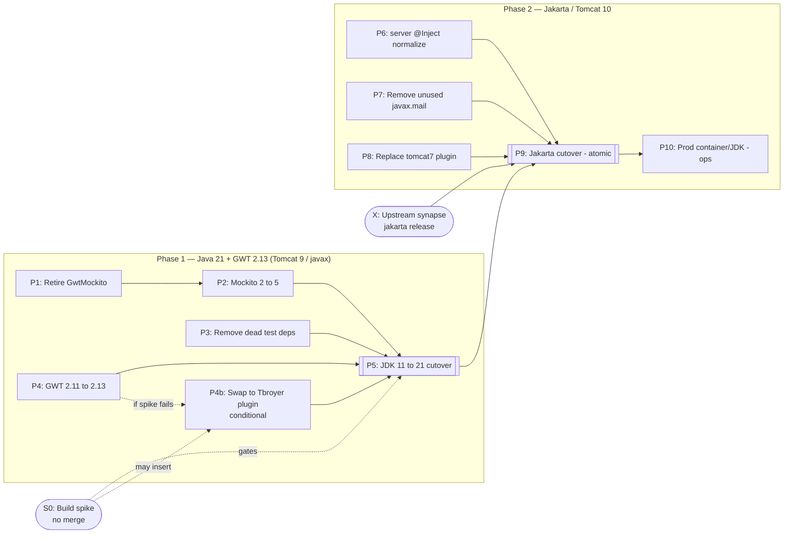
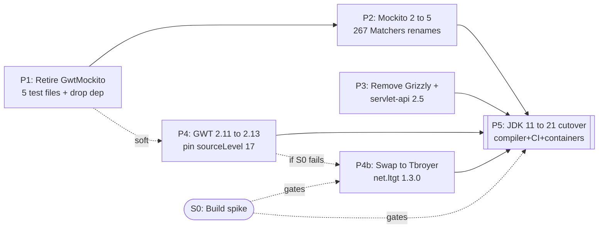
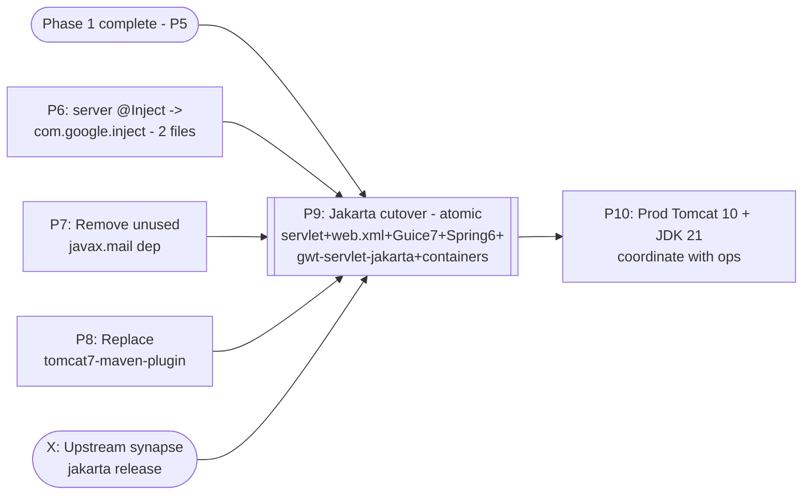

# Migration Plan: Java 21 + Tomcat 10.x

This document scopes the work to move SynapseWebClient to **Java 21** and **Tomcat 10.x
(Jakarta EE)**, identifies the blockers, and breaks the work into discrete,
independently reviewable/mergeable steps.

## Strategy

Two sequential phases:

- **Phase 1 — Java 21 + GWT 2.13.** Ships independently while staying on Tomcat 9 /
  `javax`. Lower risk.
- **Phase 2 — Tomcat 10 / Jakarta.** Builds on Phase 1 and performs the
  `javax.*` -> `jakarta.*` migration. Also depends on a parallel upstream effort to
  release jakarta-compatible `org.sagebionetworks` client libraries.

Guiding rule: **every merge to `main` must leave the build green.** This dictates what
can be split into separate PRs vs. what must remain an atomic change.

## Hard constraints discovered

- **GWT cannot translate Java 18–21 syntax.** Client + shared code
  (`org.sagebionetworks.web.client` / `.shared`) is permanently capped at **Java 17**
  language features (records, switch expressions, text blocks, `instanceof` patterns).
  Only **server-side** code gets full **Java 21**. This is inherent to GWT.
- **Tomcat 10 forces Jakarta.** The `javax.servlet` -> `jakarta.servlet` namespace change
  is atomic: Spring 6, Guice 7, and `gwt-servlet-jakarta` all reference the same servlet
  namespace and must agree at once.

## Key facts (verified)

| Area | Finding |
|------|---------|
| Current state | Compiler target **11**, CI on JDK **11**, runtime **Corretto 17**, Tomcat **9**, `javax.servlet` only |
| GWT | **2.11.0**; already ships `gwt-servlet-jakarta` (through 2.13.0) and runs on Java 21 |
| GWT plugin | `org.codehaus.mojo:gwt-maven-plugin` **2.10.0** (frozen, June 2022); decoupled from GWT toolkit version. Fallback: `net.ltgt:gwt-maven-plugin:1.3.0` (maintained) |
| `javax.servlet` surface | ~55 main files + ~24 test files; concentrated, no JAXB/validation/ws.rs/mail in source |
| `@Inject` | 689 files use `com.google.inject.Inject` (jakarta-neutral); only 7 use `javax.inject.Inject` (5 client/GIN, 2 server) |
| Spring | Shallow: no XML context, no DI, no MVC dispatcher. Only `RestTemplate`, `HttpStatus`, 3 `OncePerRequestFilter`, 1 `@Controller` |
| Guice | 6.0.0; `guice-servlet` is `javax` -> needs Guice 7 (jakarta) |
| Mockito | 2.28.2 (won't run on JDK 21); 267 files import the removed `org.mockito.Matchers`; 0 PowerMock; 0 static mocking |
| GwtMockito | Abandoned at 1.1.9 (built vs Mockito 1.10.19); only **5** test files use it; drags in transitive `com.google.gwt:gwt-dev:2.8.0` |
| Synapse libs | `synapseJavaClient` / `lib-*` are **servlet-neutral** today (verified via `dependency:tree`) |
| Prod runtime | **Not configured in this repo** (no Dockerfile/deploy manifest); must be coordinated with ops |

## Dependency graph

### Overview (phase level)

### Phase 1 detail

### Phase 2 detail

Legend: `[[ ]]` = phase-completing milestone PR; `([ ])` = non-PR node (spike, external
dependency, or ops coordination); dotted edges = conditional/soft dependencies.

## Discrete steps

| ID | Title | Scope | Depends on | Merges green on | Size |
|----|-------|-------|-----------|-----------------|------|
| **S0** | Build spike | Prove (a) codehaus gwt-maven-plugin 2.10 + GWT 2.13 runs on JDK 21, (b) Mockito 5 + byte-buddy green on 21. No merge. | — | n/a | ~1 day |
| **P1** | Retire GwtMockito | Migrate the 5 `GwtMockitoTestRunner` files to plain Mockito + mocked views; remove gwtmockito dep (also drops transitive `gwt-dev:2.8.0`) | — | JDK 11 / Mockito 2 | S |
| **P2** | Mockito 2 -> 5 | `org.mockito.Matchers` -> `ArgumentMatchers` (267 files), version bump, explicit byte-buddy >=1.14 + objenesis pins | P1 | JDK 11 (Mockito 5 runs on 11) | M (mechanical) |
| **P3** | Remove dead test deps | Drop Grizzly + `servlet-api:2.5` | — | any | XS |
| **P4** | GWT 2.11 -> 2.13 | Bump `gwtVersion`, pin `<sourceLevel>17</sourceLevel>`, clean stale GWT artifacts | (soft) P1 | JDK 11 | S |
| **P4b** | *Conditional:* swap to Tbroyer plugin | Only if S0 shows codehaus 2.10 fails on JDK 21; migrate plugin config/module layout to `net.ltgt:1.3.0` | P4, S0 | JDK 11 | M–L |
| **P5** | JDK 11 -> 21 cutover | `maven.compiler.*` -> 21, `.mvn/jvm.config` add-opens, CI JDK -> 21, `.tool-versions` -> corretto-21, codeserver image 17 -> 21 | P2, P4 (+P4b), S0 | **JDK 21**, Tomcat 9 | M |
| **P6** | Server `@Inject` normalize | 2 server `javax.inject.Inject` -> `com.google.inject.Inject` (works under Guice 6) | — | Tomcat 9 | XS |
| **P7** | Remove unused `javax.mail` | Delete dep | — | Tomcat 9 | XS |
| **P8** | Replace `tomcat7-maven-plugin` | Remove dev-run plugin (rely on docker) | — | Tomcat 9 | XS |
| **P9** | **Jakarta cutover (atomic)** | `javax.servlet` -> `jakarta.servlet` (~55 main + ~24 test), `web.xml` -> Jakarta 6.0, `gwt-servlet` -> `gwt-servlet-jakarta`, Guice 6 -> 7, Spring 5 -> 6, jackson-jakarta-xmlbind, dev+e2e containers `tomcat:9` -> `10` | P5, P6, P7, P8, **X** | **Tomcat 10** | L |
| **P10** | Prod runtime bump | Coordinate prod Tomcat 10 + JDK 21 image with ops (outside this repo) | P9 | n/a | coord |

## Why P9 cannot be split into separately-mergeable PRs

The Jakarta namespace flip is **atomic by nature**: Spring 6's `OncePerRequestFilter`,
Guice 7's `GuiceFilter`, `gwt-servlet-jakarta`'s `RemoteServiceServlet`, and the servlet
imports all reference the *same* servlet namespace and must agree at once. You cannot land
Spring 6 or Guice 7 on a Tomcat-9 / `javax` `main` and stay green.

Two ways to keep P9 reviewable despite being one merge:

- **Recommended:** develop P9 on a long-lived `jakarta` integration branch, structured as
  ordered review-chunk commits (servlet imports -> web.xml -> gwt-servlet-jakarta/RPC ->
  Guice 7 -> Spring 6 -> containers), CI'd against Tomcat 10, then merged as a unit once
  `X` lands.
- Squeeze the surface beforehand via the neutral prep PRs (P6–P8) so P9 contains only the
  irreducible namespace change.

## Ideal merge order

1. `P3`, `P1` -> `P2`
2. `P4` (-> `P4b` only if the spike requires it)
3. **`P5`** closes Phase 1
4. In parallel, land `P6`, `P7`, `P8` anytime (Tomcat 9, neutral prep)
5. When `P5` is in and `X` (upstream jakarta release) is ready, open the `P9` branch
6. Finish with `P10` (ops coordination)

## Cross-cutting coordination

- **Ops / infra:** production Tomcat 10 + JDK 21 image (outside this repo).
- **Upstream:** synapse `lib-*` / `synapseJavaClient` jakarta release must land before P9
  merges.
- **Step 0 spike** must run first; its outcome determines whether `P4b` (Tbroyer plugin
  swap) is needed.
